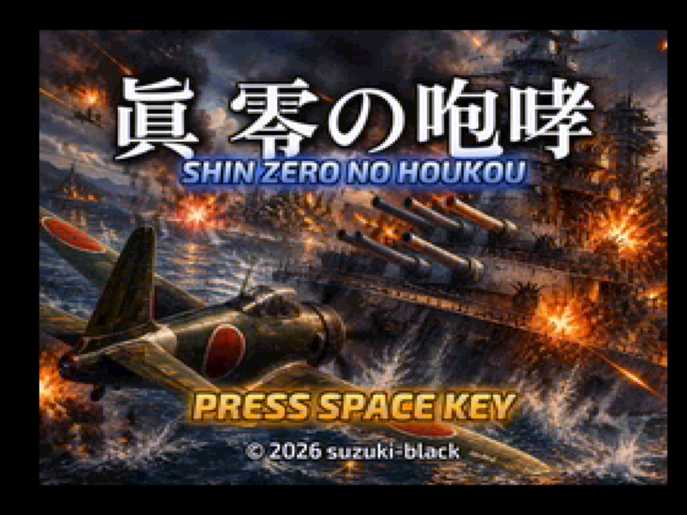
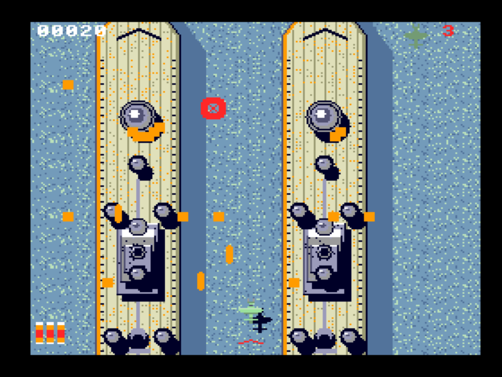
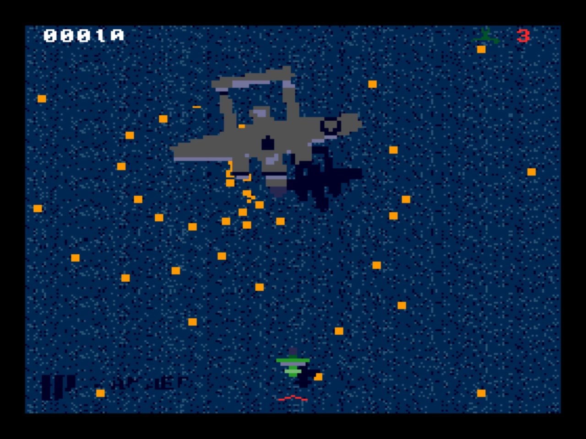
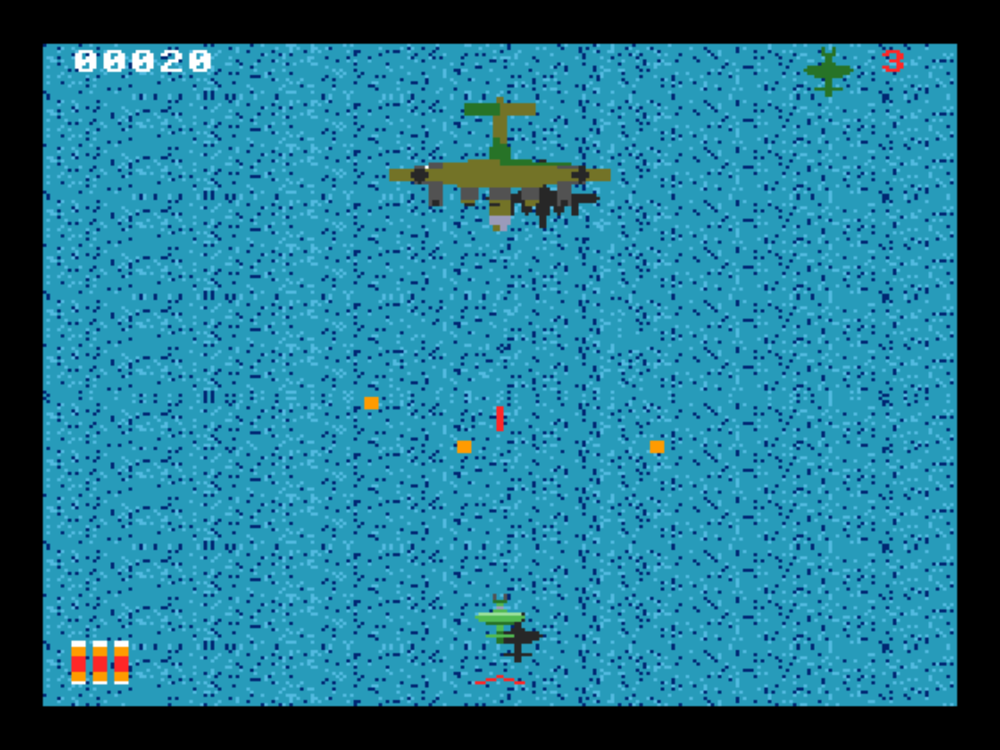
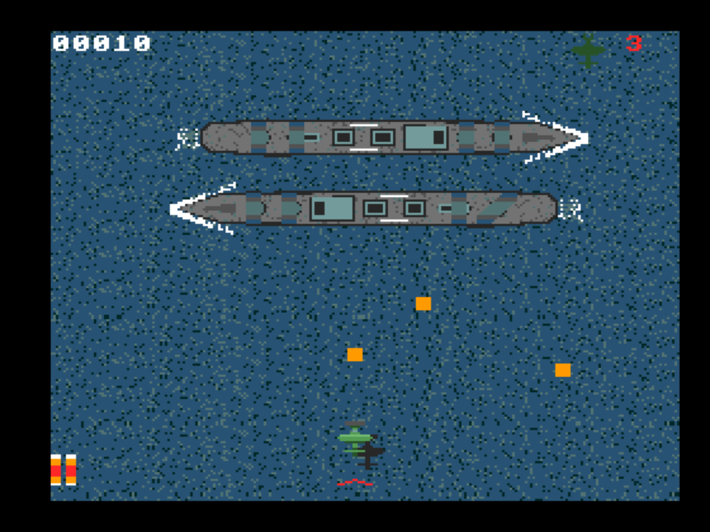
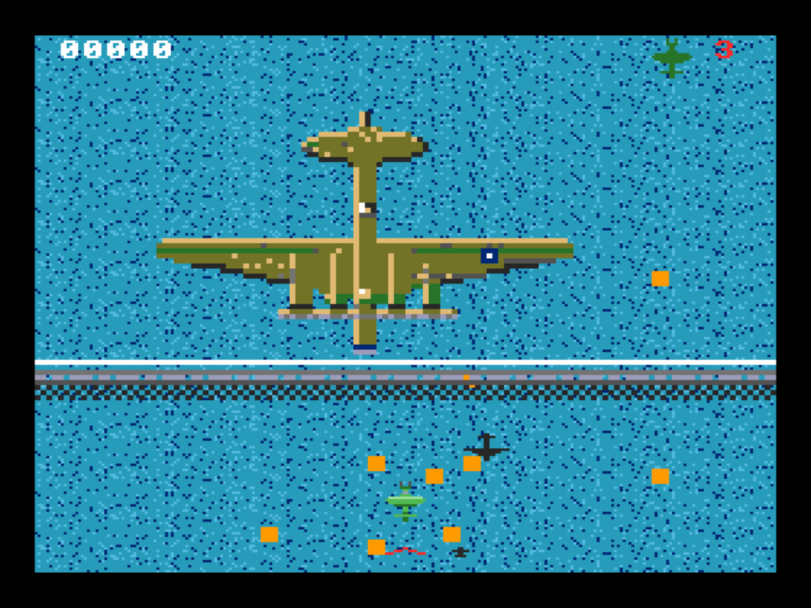

# 真 零の咆哮 / SHIN ZERO NO HOUKOU

<p align="center">
  
</p>

> ⚠️ **This is a prototype** (work in progress), published for feedback and experimentation.
> **試作品（プロトタイプ・開発中）です。** フィードバックと実験のために公開しています。

A single-player, vertically-scrolling shoot-'em-up for the **MSX turboR** (V9958 VDP · R800).
It is the third game in the *Zero no Houkou* line — after *Zero no Houkou* and *Zero no Houkou Kai* —
and the one built to answer a single question: **how far can the turboR be pushed?** Mid-bosses on
every stage, a giant bomber as the final boss, a screen-filling mega-crash, a loop manoeuvre, raster
tricks and palette-driven weather — all on an 8-bit home computer.

**Repository:** <https://github.com/suzuki-black/ZeroNoHoukouR> — currently private; it will be made
public once ready. This game is the **successor to
[BattleshipProtoR](https://github.com/suzuki-black/BattleshipProtoR)** (*Zero no Houkou Kai*).

<p align="center">
  
  
  <br><sub>Stage 4 · the twin battleships / ステージ4 双子艦　　Stage 5 · mid-boss P-61 / ステージ5 中ボス P-61</sub>
</p>

**Language:** [🇬🇧 English](#english) · [🇯🇵 日本語](#japanese)

---

<a name="english"></a>
## English

- [Story](#story)
- [Overview](#overview)
- [Features](#features)
- [Controls](#controls)
- [Requirements](#requirements)
- [Building](#building)
- [Running](#running)
- [Project structure](#project-structure)
- [Documentation](#documentation)
- [Lineage — how it got here](#lineage--how-it-got-here)
- [Scope & honest positioning](#scope--honest-positioning)
- [Feedback](#feedback--contributing)
- [Credits](#credits)
- [License](#license)
- [Disclaimer](#disclaimer)

### Story

> The samurai was enraged. He resolved that he must, without fail, rid the world of its wars.
> He knows nothing of politics. He is but a man of the blade, who has lived by honing his sword and
> playing in the wind. Before dawn today he left his homeland; crossing clouds and waves — not ten
> leagues but hundreds of sea-miles away — he came to this battlefield upon the sea. He has no
> father, no mother, and no wife. He carries only a single sword, and a vow to the comrades who
> will not return.

### Overview
- **Platform:** MSX turboR software (512 KB ASCII8 mega-ROM). The engine assumes the R800.
- **Genre:** Single-player vertical shoot-'em-up.
- **Structure:** 6 stages. Stages 1–5 are one continuous scroll each: open sea (a dogfight) →
  a **mid-boss** → open sea again → an enemy capital ship that you must destroy completely. Stage 6
  is a one-on-one duel with a giant bomber.

### Features
- **A mid-boss on every stage**, each built around a different trick:
  Fw 200 Condor (64×64, 32 directions, multi-colour) → PBY Catalina (climbs and dives; passes over or
  under you) → **two** Tribal-class destroyers (drawn on the background, each moved by its own raster band)
  → He 111 ×2 (sprite and pattern tables split by scanline so both are 64×64) → P-61 Black Widow
  (sprite magnification ×2, 96×96, with a bullet curtain drawn on the background).
- **Final stage: the XB-19 giant bomber** — a magnified sprite band with walls, background-drawn
  bullets, six weak points, and an intro that is timed to its entrance music.
- **5 capital-ship bosses, fully destructible:** Bismarck → Essex-class carrier → HMS Hood →
  the twin battleships → USS Iowa. Every main turret and all 23 anti-aircraft mounts can be shot
  away; a destroyed ship sinks stern-first beneath the waves.
- **Mega crash (bomb):** procedural lightning and thunder, then a magnified "wall of water"
  tsunami sweeps the screen and clears enemy bullets.
- **Loop manoeuvre:** the plane pulls up and grows as it climbs (pre-baked frames copied by the VDP);
  bullets pass underneath.
- **Power-ups:** shoot the silver enemy plane, pick up its drop tank — 3-way shot, then stronger,
  then piercing. A chevron icon shows the current level.
- **Raster and palette tricks:** mid-frame sprite-table switching to beat the 32-sprite limit,
  shock-wave distortion via R#23, per-band horizontal scrolling, and a palette engine for time of
  day and weather (day / sunset / storm with lightning / morning fog / night).
- **H.TIMI 60 Hz PSG driver** with **original music** for every stage, the mid-bosses and the final
  boss, plus sound effects.

### Controls
| Input | Action |
|-------|--------|
| Arrow keys / joystick | Move |
| Space / keyboard **A** / trigger A | Fire · confirm |
| Keyboard **B** or **M** / trigger B (alone) | Mega crash (bomb) |
| Fire + B (A+B) | Loop manoeuvre |

### Requirements
- **Target hardware:** MSX turboR (e.g. Panasonic FS-A1GT).
- The turboR system ROM is copyrighted and is **not** included. Correctness is developed and verified
  in [openMSX](https://openmsx.org/) with C-BIOS; play-testing and turboR performance are checked on
  the turboR machine of [WebMSX](https://webmsx.org/). **It has not yet been tested on real hardware.**

### Building
Requires [SDCC](https://sdcc.sourceforge.net/), Node.js and Python 3 (with Pillow).

```bash
make
```

This produces `GAME.ROM` (a 512 KB ASCII8 mega-ROM). `make DEBUG_FPS=1` builds a debug ROM with an
FPS counter (run `make clean` when switching).

### Running
Under openMSX, with a turboR machine (e.g. `Panasonic_FS-A1GT`, which needs its system ROMs):

```bash
openmsx -machine Panasonic_FS-A1GT -carta GAME.ROM -romtype ASCII8
```

Without turboR firmware, copy [tools/openmsx/CBIOS_turboR.xml](tools/openmsx/CBIOS_turboR.xml) into
`~/.openMSX/share/machines/`. It is a machine definition that runs the free C-BIOS MSX2+ ROMs on turboR
hardware (R800 + S1990), and it is what this project is developed on:

```bash
openmsx -machine CBIOS_turboR -carta GAME.ROM -romtype ASCII8
```

`GAME.ROM` also runs in [WebMSX](https://webmsx.org/) (drag-and-drop, turboR machine).

### Project structure
```
src/core/      resident engine (VDP, entity pool, scroll, sound, HUD, input, raster, overlays)
src/scenes/    scene FSM (stage) — the per-frame game loop
src/banked/    banked scenes, RAM overlays (mid-bosses, final boss, sinking, mega crash, loop …),
               hot code copied to RAM
src/include/   headers
src/crt0rom.s  ROM boot / ASCII8 mapper init / BSS clear
tools/         asset generators (gen_*.py / gen_assets.mjs), rompack.mjs (mega-ROM packer),
               openmsx/ (C-BIOS turboR machine definition)
docs/          design & development notes
```

### Documentation
- **[Architecture / アーキテクチャ](docs/ARCHITECTURE.md)** — memory/bank/VRAM maps, resident-vs-bank
  discipline, scene FSM, RAM code execution.
- **[Stage layout / ステージ構成](docs/ステージ構成.md)** — every stage, the numbers, and the hardware limits.
- **[Roadmap / ROADMAP](docs/ROADMAP.md)** — the working plan and a record of every issue found in
  play-testing and how it was fixed.
- **[Design memo / 次版設計メモ](docs/次版設計メモ_CPU重VDP軽の演出と1943ギミック.md)** — the plan for
  CPU-heavy / VDP-light effects and *1943*-style gimmicks this game grew from.
- **[Game spec / 仕様書](docs/仕様書.md)** · **[Algorithm notes / アルゴリズム解説](docs/アルゴリズム解説.md)** ·
  **[Performance / 性能と高速化](docs/性能と高速化.md)** · **[Development notes / 苦労と教訓](docs/苦労と教訓.md)**
  — carried over from *Zero no Houkou Kai* and extended.

### Lineage — how it got here
| # | Title | Repository | What it was |
|---|---|---|---|
| 1 | *(untitled)* | — | A BASIC prototype written with [FunctionBASIC](https://github.com/suzuki-black/FunctionBASIC). Currently being remade; no longer in any repository. |
| 2 | **零の咆哮** *Zero no Houkou* | [BattleshipProto](https://github.com/suzuki-black/BattleshipProto) (private) | Rewritten in C + Z80 (SDCC). 128 KB mega-ROM for MSX2+ / turboR, 5 stages. |
| 3 | **零の咆哮 改** *Zero no Houkou Kai* | [BattleshipProtoR](https://github.com/suzuki-black/BattleshipProtoR) (public) | A ground-up turboR engine. 256 KB, v0.2.0. The clean, playable baseline. |
| 4 | **真 零の咆哮** *Shin Zero no Houkou* | this repository | The turboR spectacle built on top of it. 512 KB. |

1. **The BASIC prototype.** It started as a one-stage vertical shooter in MSX-BASIC (SCREEN 5),
   written in FunctionBASIC's structured dialect and transpiled to line-numbered BASIC. The
   "battleship" was literally a **ship-shaped rectangle drawn on the background**, with three
   turrets to shoot. To avoid a sluggish full-screen redraw it already used the V9958's **R#23
   hardware vertical scroll**, streaming in one new row every 16 dots through a few machine-code
   routines called with `USR`.
2. ***Zero no Houkou*** kept that scrolling idea and rewrote everything in C + Z80 as a 128 KB
   mega-ROM: five real ships (Bismarck, Essex, Hood, the twins, Iowa) drawn from public-domain
   blueprints, a pseudo multi-scroll sea, a 60 Hz interrupt PSG driver with per-stage music, an
   ending, and the hidden settings menu.
3. ***Zero no Houkou Kai*** rebuilt the engine for the turboR alone. The key discovery was that
   the R800 slows to Z80 speed when it fetches code from cartridge ROM, so the hot code is copied
   to RAM and run from there. It added fully destructible ships (main guns *and* AA), rotating
   turrets that aim at you, ship-specific weapons and procedural 8-direction sprites, at a fixed
   30 fps. It was deliberately plain — no power-ups, no bombs — and pushed the flashy ideas to
   "a separate repository".
4. ***Shin Zero no Houkou*** is that repository. On the same engine and assets it adds RAM overlays
   for effect code, raster interrupts (sprite-table doubling, shock waves, band scrolling), a
   palette engine, the mega crash, the loop, power-ups, a mid-boss on every stage, the stern-first
   sinking, and a sixth stage against the XB-19.

<p align="center">
  
  
  
  <br><sub>Stage 1 · Fw 200 / ステージ1 Fw 200　　Stage 3 · two destroyers / ステージ3 駆逐艦2隻　　Stage 6 · XB-19 / 最終面 XB-19</sub>
</p>

### Scope & honest positioning
This is an **experimental / study project**, and it is worth being plain about what it is.

- **The point is the turboR spectacle, not balance.** Every feature here was chosen to show what the
  R800 and V9958 can do in a game loop; difficulty and pacing are tuned by play-testing but come
  second.
- **It is still a prototype.** Everything is play-tested on WebMSX's turboR as it is built (not yet on
  real hardware), and problems found there are recorded, with their fixes, in [ROADMAP](docs/ROADMAP.md).
- **It does not pretend to rival Capcom's *1943*.** It is an attempt to get a little closer to that
  arcade feel on a home computer that was never meant to have it.

### Feedback & Contributing
This is an experimental prototype released for feedback. Once the repository is public, please use
GitHub Issues to report bugs or share impressions. Pull requests are welcome for clearly-scoped fixes.

### Credits
- **Original Concept / Direction:** suzuki-black
- **Program / Graphics:** Claude Code (Anthropic Claude)
- **Sound (music & SFX):** Claude Code (Anthropic Claude) — all original, not copied from any existing work
- **Title illustration:** Microsoft Copilot × Claude Code (Anthropic Claude) — a collaboration
- **Title lettering fonts:** [Zen Antique](https://fonts.google.com/specimen/Zen+Antique) and
  [Exo 2](https://fonts.google.com/specimen/Exo+2) — SIL Open Font License 1.1 (the font files are not
  included in this repository)

### License
**MIT** © 2026 suzuki-black. See [LICENSE](LICENSE). **Everything in this repository — code, graphics,
and music — is released under the MIT license.** All assets are original works created for this game;
no rights are reserved beyond the MIT terms.

The ships and aircraft that appear are real historical equipment; no specific game's names,
characters, images, or audio are used.

### Disclaimer
The weapons, ships, and aircraft in this game are fiction that merely borrows historical names.
They are **not** intended as accurate depictions of real equipment; their shapes, colors, and
performance have been altered for the sake of the game. (Hardware limits of the MSX also mean
silhouettes may differ from the real thing.)

---

<a name="japanese"></a>
## 日本語

- [あらすじ](#あらすじ)
- [概要](#概要)
- [特徴](#特徴)
- [操作](#操作)
- [動作環境](#動作環境)
- [ビルド](#ビルド)
- [実行](#実行)
- [ディレクトリ構成](#ディレクトリ構成)
- [ドキュメント](#ドキュメント)
- [ここに至るまで（系譜）](#ここに至るまで系譜)
- [位置づけ](#位置づけ正直な自己評価)
- [フィードバック](#フィードバック)
- [クレジット](#クレジット)
- [ライセンス](#ライセンス)
- [免責](#免責)

### あらすじ

> 古武士は激怒した。必ず、かの世の戦乱を除かなければならぬと決意した。古武士には政治がわからぬ。
> 古武士は、ひとりの武辺者である。刃を研ぎ、風と遊んで暮して来た。きょう未明古武士は故郷を発ち、
> 雲を越え波を越え、十里どころか遥か幾百海里を隔てた此の海上の激戦地にやって来た。古武士には
> 父も、母も無い。女房も無い。ただ一振りの刀と、還らぬ戦友らへの誓ひばかりを抱いてゐる。

### 概要
- **対応機種:** MSX turboR 用ソフト（512KB の ASCII8 メガROM）。R800 を前提に設計しています。
- **ジャンル:** 1人用・縦スクロールシューティング。
- **構成:** 全6面。1〜5面は画面カットの無い地続きの縦スクロールで、海（空戦）→ **中ボス** → 再び海
  → 敵の大型艦との戦い、と進みます。艦を**完全に撃破**するとクリア。6面は巨大爆撃機との一騎打ちです。
- 本作は「零の咆哮」「零の咆哮 改」に続く3作目で、**「turboR をどこまで詰め込めるか」**を主題に
  しています。

### 特徴
- **全面に中ボス**。1体ずつ違う技で見せます:
  Fw 200 コンドル（64×64・32方向・多色）→ PBY カタリナ（高度を上げ下げし、自機の上や下を通る）
  → トライバル級駆逐艦 **2隻**（背景に描き、走査線の帯ごとに別々に横へ動かす）→ He 111 ×2
  （走査線でスプライト表と絵の表を分け、2機とも 64×64）→ P-61 ブラックウィドウ（スプライト2倍拡大の
  96×96・背景に描く弾幕）。
- **最終面は巨大爆撃機 XB-19**。拡大スプライトの帯と壁、背景に描く弾、6か所の弱点、登場曲に合わせた
  登場演出。
- **全破壊できる5隻の大型艦**: ビスマルク → エセックス級空母 → HMS フッド → 双子戦艦 → USS アイオワ。
  主砲と対空砲23基をすべて撃ち落とせ、撃沈すると船尾から海へ沈んでいきます。
- **メガクラッシュ（ボム）**: 手続き生成の稲妻と雷鳴のあと、拡大スプライトの「水の壁」の津波が画面を
  駆け上がり、敵弾を消します。
- **宙返り**: 引き起こして上昇しながら大きくなる（VDP に焼いたコマを写すだけ）。回っている間は敵弾が下を抜けます。
- **パワーアップ**: 銀色の敵機を落とすと増槽が出て、取るたびに 3方向弾 → 強化 → 貫通。段階は画面下の山形で表示。
- **走査線とパレットの技**: フレームの途中でスプライト表を切り替えて32枚の上限を越える、R#23 による衝撃波の
  ゆがみ、帯ごとの横スクロール、時間帯と天候（昼／夕焼け／稲光の荒天／朝霧／夜戦）を作るパレットエンジン。
- **H.TIMI 60Hz 割込みの PSG 音ドライバ**。各面・中ボス・最終面の曲はすべて本作のためのオリジナルで、効果音付き。

### 操作
| 入力 | 動作 |
|------|------|
| カーソルキー／ジョイスティック | 移動 |
| スペース／キーボード **A**／トリガーA | 発射・決定 |
| キーボード **B** または **M**／トリガーB（単押し） | メガクラッシュ（ボム） |
| 撃ちながら B（A＋B） | 宙返り |

### 動作環境
- **対象実機:** MSX turboR（例: Panasonic FS-A1GT）。
- turboR 本体 ROM は著作物のため**同梱していません**。正しさは [openMSX](https://openmsx.org/)（C-BIOS）で
  開発・検証し、テストプレイと turboR での速さは [WebMSX](https://webmsx.org/) の turboR で確認しています。
  **実機での動作はまだ確認していません。**

### ビルド
[SDCC](https://sdcc.sourceforge.net/)、Node.js、Python 3（Pillow）が必要です。

```bash
make
```

`GAME.ROM`（512KB の ASCII8 メガROM）が生成されます。`make DEBUG_FPS=1` で FPS 表示付きのデバッグ版になります
（切り替えるときは `make clean`）。

### 実行
openMSX では turboR の機種（例: `Panasonic_FS-A1GT`。本体 ROM が必要）で:

```bash
openmsx -machine Panasonic_FS-A1GT -carta GAME.ROM -romtype ASCII8
```

turboR の本体 ROM が無い場合は、[tools/openmsx/CBIOS_turboR.xml](tools/openmsx/CBIOS_turboR.xml) を
`~/.openMSX/share/machines/` へ置いてください。無償の C-BIOS（MSX2+）を turboR のハード（R800＋S1990）で
動かす機種定義で、本作の開発もこれで行っています:

```bash
openmsx -machine CBIOS_turboR -carta GAME.ROM -romtype ASCII8
```

`GAME.ROM` は [WebMSX](https://webmsx.org/)（ドラッグ&ドロップ・turboR 機種）でも動作します。

### ディレクトリ構成
```
src/core/      常駐エンジン(VDP/エンティティプール/スクロール/音/HUD/入力/走査線割込み/オーバレイ)
src/scenes/    シーンFSM(ステージ) — 毎フレームのゲームループ
src/banked/    バンクのシーン、RAM オーバレイ(中ボス・最終面・撃沈・メガクラッシュ・宙返り …)、
               RAM へ写して実行するホットコード
src/include/   ヘッダ
src/crt0rom.s  ROM起動 / ASCII8マッパー初期化 / BSSゼロ化
tools/         アセット生成(gen_*.py / gen_assets.mjs), rompack.mjs(メガROM生成),
               openmsx/(C-BIOS の turboR 機種定義)
docs/          設計・開発ノート
```

### ドキュメント
- **[アーキテクチャ](docs/ARCHITECTURE.md)** — メモリ/バンク/VRAM 地図、常駐とバンクの規律、シーン FSM、RAM 実行。
- **[ステージ構成](docs/ステージ構成.md)** — 全面の進行・数値・ハードの制約。
- **[ROADMAP](docs/ROADMAP.md)** — 作業計画と、テストプレイで見つかった不具合とその直し方の記録。
- **[次版設計メモ](docs/次版設計メモ_CPU重VDP軽の演出と1943ギミック.md)** — 本作の出発点になった、CPU 重・VDP 軽の演出と
  『1943』的なギミックの計画。
- **[仕様書](docs/仕様書.md)** ・ **[アルゴリズム解説](docs/アルゴリズム解説.md)** ・ **[性能と高速化](docs/性能と高速化.md)** ・
  **[苦労と教訓](docs/苦労と教訓.md)** — 「零の咆哮 改」から引き継いで書き足したもの。

### ここに至るまで（系譜）
| # | タイトル | リポジトリ | どんなものか |
|---|---|---|---|
| 1 | （タイトルなし） | — | [FunctionBASIC](https://github.com/suzuki-black/FunctionBASIC) で書いた BASIC のプロトタイプ。現在リメイク中で、リポジトリには残っていません。 |
| 2 | **零の咆哮** | [BattleshipProto](https://github.com/suzuki-black/BattleshipProto)（非公開） | C＋Z80（SDCC）で書き直し。MSX2+／turboR 用 128KB メガROM・全5面。 |
| 3 | **零の咆哮 改** | [BattleshipProtoR](https://github.com/suzuki-black/BattleshipProtoR)（公開） | turboR 専用に一から作ったエンジン。256KB・v0.2.0。遊べる素の土台。 |
| 4 | **真 零の咆哮** | 本リポジトリ | その上に turboR の見せ場を積んだもの。512KB。 |

1. **BASIC のプロトタイプ。** 最初は MSX-BASIC（SCREEN 5）の1面だけの縦スクロールシューティングでした。
   FunctionBASIC の構造化 BASIC で書き、行番号付きの BASIC へ変換して動かしていました。「戦艦」は文字どおり
   **背景に描いた船っぽい長方形**で、砲台3基を壊すだけ。それでも全画面の描き直しでもっさりしないよう、
   V9958 の **R#23 ハードウェア縦スクロール**を使い、16ドット進むごとに新しい1行だけを `USR` で呼ぶ
   マシン語で流し込んでいました。
2. **「零の咆哮」** はこのスクロールの考え方を引き継ぎ、C＋Z80 の 128KB メガROM として全部を書き直しました。
   パブリックドメインの図面を元にした実在の5隻（ビスマルク・エセックス・フッド・双子艦・アイオワ）、
   海の疑似多重スクロール、60Hz 割込みの PSG 音ドライバと面別の曲、エンディング、隠しの設定メニュー。
3. **「零の咆哮 改」** は turboR だけを相手にエンジンを作り直しました。鍵になったのは「R800 はカートリッジ
   ROM からコードを読むと Z80 並みに遅くなる」という発見で、毎フレーム走るコードを RAM へ写してそこで実行します。
   主砲と対空砲まで全部壊せる艦、自機を狙って旋回する主砲、艦ごとの固有兵装、手続き生成の8方向スプライトを
   30fps 固定で実現。ゲームとしては意図して素っ気なく（パワーアップもボムも無し）、派手な案は
   「別リポジトリで」と先送りにしていました。
4. **「真 零の咆哮」** がその別リポジトリです。同じエンジンと素材の上に、演出コードの RAM オーバレイ、
   走査線割込み（スプライト表の二重化・衝撃波・帯ごとの横スクロール）、パレットエンジン、メガクラッシュ、
   宙返り、パワーアップ、全面の中ボス、船尾からの撃沈、そして XB-19 と戦う6面目を積みました。

<p align="center">
  
  
  
  <br><sub>ステージ1 Fw 200　　ステージ3 駆逐艦2隻　　最終面 XB-19</sub>
</p>

### 位置づけ（正直な自己評価）
本作は**実験的な習作**です。何であるかを正直に書いておきます。

- **主題は turboR の見せ場で、バランスは二の次**です。どの機能も「R800 と V9958 がゲームループで何を
  できるか」を見せるために選びました。難しさや間合いは遊びながら調整していますが、優先順位は下です。
- **まだ試作品**です。作りながら WebMSX の turboR で確かめ（実機ではまだ未確認）、そこで見つかった不具合と直し方は
  [ROADMAP](docs/ROADMAP.md) に記録しています。
- **カプコンの『1943』に並ぶつもりはありません。** そういう手応えを想定していない家庭用の機械で、
  あのアーケードの感触に少しでも近づけたら——という試みです。

### フィードバック
本作はフィードバックのために公開している実験的な試作品です。リポジトリ公開後は、不具合報告や
感想は GitHub Issues でお願いします。範囲の明確な修正の Pull Request も歓迎します。

### クレジット
- **原案・ディレクション:** suzuki-black
- **プログラム／グラフィック:** Claude Code（Anthropic Claude）
- **サウンド（BGM・効果音）:** Claude Code（Anthropic Claude）― すべてオリジナル。既存楽曲のコピーではありません。
- **タイトルイラスト:** Microsoft Copilot × Claude Code（Anthropic Claude）の合作
- **タイトル文字の書体:** [Zen Antique](https://fonts.google.com/specimen/Zen+Antique) と
  [Exo 2](https://fonts.google.com/specimen/Exo+2)（SIL Open Font License 1.1。フォントのファイルは本リポジトリに含みません）

### ライセンス
**MIT** © 2026 suzuki-black. 詳細は [LICENSE](LICENSE) を参照。**コード・グラフィック・音楽を含む
本リポジトリのすべてを MIT ライセンスで公開**します（いずれも本作のために制作したオリジナルで、
MIT の条件を超える権利主張はしません）。

登場する軍艦・航空機は実在の史実兵器で、特定ゲーム作品の名称・キャラクター・画像・音源は一切
使用していません。

### 免責
本作の兵器・艦船・航空機は、史実の名称を借りたフィクションです。実在兵器の正確な描写を意図した
ものでは**なく**、形状・色・性能はゲームのために改変しています。（MSX のハード制約により、実物と
シルエットが異なる場合もあります。）
